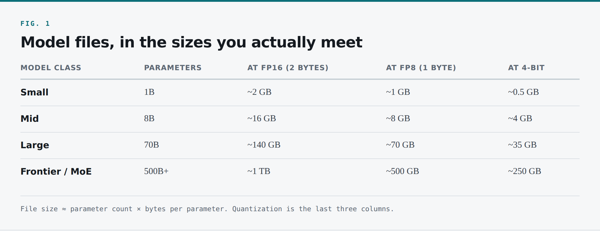
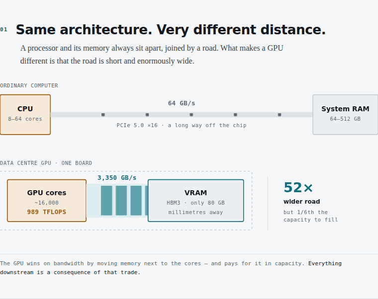
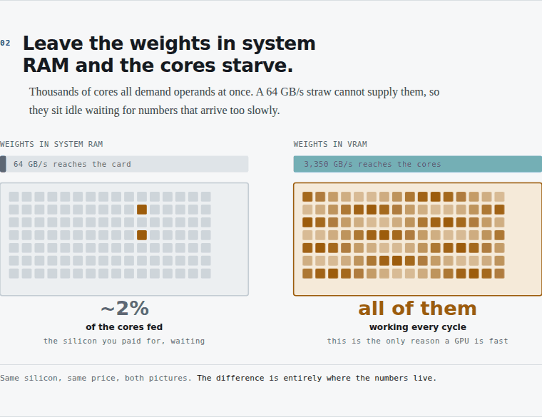
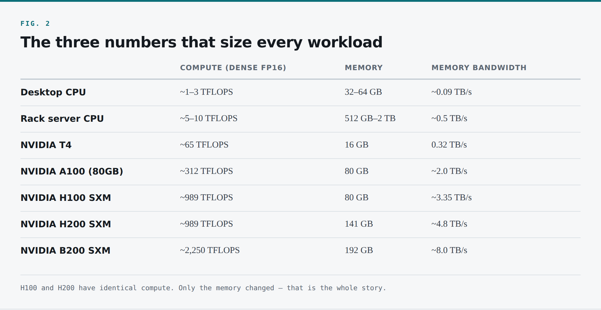

Amazon, Google, Microsoft and Meta will spend somewhere around **$700 billion on capital expenditure in 2026**, the overwhelming majority of it on AI infrastructure. That figure is roughly four times what the same four companies were spending in 2021, before ChatGPT existed. McKinsey's estimate for total data centre investment through 2030 is **$6.7 trillion**.

Sit with the second-order consequence of those numbers, because it is the reason I am writing this.

Someone has to rack that hardware. Someone has to get a driver stack onto it, schedule work across it, keep utilisation above the line where the finance team stops asking questions, notice when a single misrouted request has stalled thirty other people's responses, and page themselves at 3am when a node's ECC error rate crosses a threshold. That work is not machine learning. It is scheduling, memory management, network topology, cache locality, queueing, capacity planning and observability — the exact discipline SREs, platform engineers and systems administrators have been practising for twenty years.

The people who can do it well are among the most sought-after engineers in the industry right now, and the barrier to entry is far lower than the hype suggests. LinkedIn's 2026 fastest-growing jobs list puts AI engineer at number one, but read further down and you find data centre technicians, commissioning managers, and the note that cloud, SRE and platform roles remain "still very in demand" — because AI applications are compute-intensive, expensive and prone to falling over, and someone has to make them run well, cheaply and reliably.

I have spent about sixteen years in this territory — SRE, platform engineering, distributed systems, latterly AI infrastructure — at a scale measured in exabytes of storage and five figures of Kubernetes nodes. I now build a quantum computing platform, which is different exotic hardware with a strikingly similar operational shape: scarce expensive accelerators, a scheduling problem, a memory hierarchy that decides everything, and a large gap between the demo and the production system.

Here is what I keep having to explain to very good infrastructure engineers who have convinced themselves this world is closed to them: **almost none of it is machine learning.** By the time a model reaches you, the learning is over. What you have is a large file of numbers and a hard systems problem.

# 1. What is actually behind the box you type into?

You open ChatGPT, you type a question, you hit Enter, and a moment later an answer comes back.

Start with the name, because the name is two things stuck together. "Chat" is the application — the website, the text box, the conversation history. "GPT" is the model — the thing behind the scenes that reads your question and works out the answer.

GPT is one model among many: Claude, Gemini, Llama, Qwen, Mistral, DeepSeek, and a long tail beyond. Different names, different weights, different licences, same shape underneath — a model doing the work, with an application wrapped around it.

So what is a model?

## 1.1 The smallest possible model

Forget AI for a second. Picture a tiny machine. You drop a number in, a different number comes out. Drop in 3, out comes 6. Drop in 10, out comes 20. Every time, it doubles whatever you gave it.

That is a model. It takes an input, does some arithmetic, hands you an output. The entire behaviour — the doubling — comes down to one number hiding inside it: × 2.

There are two separate things in that one line.

First, the **formula**: the shape of the calculation. Input, multiply, output. Fixed. Structure. Someone wrote it.

Second, the **number sitting inside it**: the 2. That is the part the machine learned, and it has a name. We call it a **weight**.

Change the weight from 2 to 3 and the same formula now triples. Same structure, different number, completely different behaviour. Hold onto that distinction; it survives all the way up to a 500-billion-parameter frontier model.

## 1.2 Making it do something real

One weight and one multiplication will not get you far. Say you want to estimate the price of a house. A house has measurable things — size, bedrooms, age — and each pushes the price by some amount.

```
price = (size × 300)
      + (bedrooms × 50,000)
      - (age × 1,000)
      + 25,000
```

Still multiply and add — the same arithmetic as the doubling box — but now with several weights. Each says how much that one input matters.

Where do those numbers come from? You do not make them up. You show the formula thousands of real houses with their sizes, bedroom counts, ages and actual sale prices, and let it work out the weights that best fit.

**That process of working out the weights from examples is training.** It happens once, it is enormously expensive, and — the part that matters for us — it is over by the time the model reaches your infrastructure. Everything in this article is about *inference*: running an already-trained model. Training is a different discipline with different infrastructure problems. Inference is the one that runs 24/7 and generates the bill.

So: **a model is a formula, and its weights are numbers learned from examples.**

## 1.3 Scaling the formula up

A house price needed a handful of weights. Understanding a sentence needs far more, because language is much more tangled than square footage.

So the formula grows. More inputs, more multiplications, more weights, stacked in layers where the output of one becomes the input of the next. Keep growing it, arrange it in one particular pattern, and you arrive at the shape behind every modern language model: the **transformer**.

Do not worry about how it works inside. What matters is *what it is* — the same idea as the doubling box, just enormous and wired in a specific pattern. The transformer is the formula. It is written once, in code, and it is broadly the same across GPT, Claude, Llama and everything else.

What makes each different is not the formula. It is the weights.

Which brings us to the fact that reframes this whole domain for infrastructure people.

**The transformer is about a page of code. All of the knowledge is in the weights.**

A real model does not have four weights, or four hundred. It has billions — and those billions have to live somewhere, so they sit, quite literally, as a file on a disk. Open one up and that is all you would find. A very large file full of numbers, waiting to be poured into the formula.

## 1.4 Model files, in the sizes you will actually meet

Weights are usually stored at 16 bits — two bytes — per parameter. So the arithmetic for "how big is this thing" is refreshingly simple:

> **File size ≈ parameter count × bytes per parameter**



*Model files, in the sizes you actually meet*

That last column previews **quantization** — storing each weight in fewer bits to shrink the file. It costs a little accuracy and buys a lot of memory and bandwidth, and it returns in Part 3 as one of the highest-leverage knobs you have.

To use one of these files you load it off disk into memory, hand the model your question, let the formula run all those numbers over what you gave it, and out comes the answer on screen.

Load the file into memory. Feed it text. Get text back. That is a model running, at its simplest.

Which raises the obvious question. If a model is just a file, and running it is only loading it into memory and doing arithmetic — why can't you run one on your laptop? Take one of the smaller models, the kind that fits in your RAM with room to spare. Why not?

To answer that, we need to look at the computer more closely.
---

### Key Takeaways
- A model is a **formula plus weights**. The formula is a page of code; the knowledge is billions of numbers in a file.
- **Training is over** by the time the model reaches your infrastructure. Everything here is inference — the part that runs 24/7 and generates the bill.
- Size is arithmetic: **parameters × bytes per parameter**. 70B at FP16 ≈ 140 GB, and that is before a single token is processed.
- Quantization (FP8, 4-bit) is the first lever on that number, and it is the one most teams reach for last.


# 2. Why your laptop can't do it — the memory wall

Think about any computer you have ever used. Inside, there are two parts we care about: the **CPU**, which does the thinking, and the **RAM**, where the computer keeps the data the CPU is working on.

Notice something that comes back repeatedly: **these two parts sit apart.** The CPU is in one place, memory is in another, and a bus connects them.

Take the smallest calculation there is. You punch `6 × 7` into a calculator. Those two numbers land in memory first. The CPU reads them out, multiplies, and writes 42 back into memory. Every single calculation is that same round trip. Fetch, compute, write back. Processor here, memory there, a road between. That is how essentially all computing works, and the width of that road is one of the two things that decide how fast anything runs.

## 2.1 The CPU is a brilliant generalist

A CPU has a handful of very powerful cores — eight, sixteen, sixty-four — each enormously sophisticated: deep pipelines, branch prediction, out-of-order execution, several levels of cache. It works through complicated tasks one after another, very fast, and it handles code full of unpredictable branches beautifully. For your browser, your editor, your OS, a web server handling requests, that is exactly what you want. A CPU is optimised for *latency on complicated, sequential work*.

What is a model doing under the hood?

At its core, running a model is billions of very small multiplications arranged as matrix multiplies. And here is the important part: **these multiplications do not depend on each other.** Every output element of a matrix multiply can be computed independently of every other one. They can all happen at the same time.

That is a fundamentally different shape of work. No branches, no unpredictable control flow — just an enormous amount of identical, independent arithmetic. Hand it to a CPU and it works through it mostly in sequence. It will get every one right, and you will wait a very long time.

**The work is massively parallel; the CPU is built to be fast at sequential work.** We need a different kind of processor.

## 2.2 The GPU is the exact opposite trade

A GPU is built the other way round. Instead of a handful of powerful cores it has thousands of small, simple ones, all doing arithmetic at the same time. An NVIDIA T4 — a modest, old inference card — has around 2,500 CUDA cores. An H100 has over 16,000, plus tensor cores that do nothing but matrix multiplication.

A good server CPU manages perhaps 1–10 TFLOPS. A data centre GPU does 1,000–2,250. Two orders of magnitude more arithmetic per second, for exactly the kind a model needs.

So the GPU solves the maths problem, and immediately creates a new one.

## 2.3 Feeding thousands of cores

A processor needs memory to feed it data, and thousands of cores demanding operands is a *lot* of demand. For a model, what they are demanding is the weights.

If you leave those sitting in ordinary system RAM, you have a problem. System RAM is on the other side of a PCIe bus — even Gen5 ×16 gives you roughly 64 GB/s each way. That sounds like a lot until you compare it with what the cores can consume, which is on the order of terabytes per second. You are roughly fifty times too slow. Fine for a CPU doing a few things at a time; useless for thousands of cores all demanding data at once. They end up idle, waiting for numbers that arrive too slowly.

So you give the GPU its own memory, built onto the card, right next to the cores. **VRAM** — on modern data centre cards, High Bandwidth Memory, stacked vertically and connected by an extremely wide interface.

That is the picture from earlier, rearranged. On an ordinary computer the CPU and RAM sit apart, connected by a road. A GPU packs the same pairing tightly onto a single board, so the data never travels far and the road is enormously wider: **terabytes per second instead of gigabytes.**


*A processor and its memory always sit apart. On a GPU the road is short and 52× wider.*

## 2.4 The catch: VRAM is fast but small

That solution comes with a cost, and the cost is capacity. HBM is expensive and physically constrained. A T4 has 16 GB. An A100 has 80 GB. Even a B200 — current top of the line — has 192 GB.

Remember the model sizes from a few sections back. A 70B model at FP16 needs about 140 GB just for the weights to *sit* in memory, before processing a single token.

**Space in VRAM is the scarcest resource in this entire domain.** Almost every technique in the rest of this article — quantization, paged attention, sharding, cache offloading, disaggregation — exists because VRAM is small.


*Same silicon, same price. The difference is entirely where the numbers live.*

Make this concrete, because it is the most important intuition to carry forward. In classic web infrastructure, the resource you run out of is CPU, and you scale by adding replicas. In LLM serving, **the resource you run out of is GPU memory**, and adding replicas is brutally expensive because each one needs its own full copy of the weights on its own dedicated card. That single difference changes capacity planning, autoscaling, routing and cost modelling. Get it wrong and you will buy a lot of hardware that sits idle.

## 2.5 The three numbers that size every AI workload

Every accelerator you will ever meet is described by three numbers.

1. **Compute** — arithmetic per second, in TFLOPS. Note the precision it is quoted at; FP8 figures are roughly double FP16, and FP4 double again.
2. **Capacity** — memory in GB. This decides what fits.
3. **Bandwidth** — how fast it reads its own memory, in TB/s. This decides how fast you generate tokens.

Every generation adds more of all three, rarely in the same proportion, and the ratio between them determines which workloads a card is good at.

Here is the comparison, including machines you already know so the scale lands:



*The three numbers that size every workload*

Read across the H100 and H200 rows. **They have identical compute.** The H200 is the same processor. What changed is memory: 80 GB to 141 GB, and 3.35 TB/s to 4.8 TB/s.

NVIDIA did not build that card because customers wanted more FLOPS. They built it because inference workloads were running out of memory and bandwidth while the tensor cores sat half idle. That design decision is the clearest evidence I can offer that the thesis of this article — *this is a memory systems problem* — is industry consensus and not my opinion. The B200 continues the trend: native FP4, and 8 TB/s.

## 2.6 A note on the ratio

There is a number worth computing for any card you are considering, and I have almost never seen it on a spec sheet:

> **Ridge point = Compute ÷ Bandwidth**

For an H100: 989 TFLOPS ÷ 3.35 TB/s ≈ **295 FLOPs per byte**.

That is the machine's balance point. If your workload does fewer than 295 floating point operations per byte read from memory, you are memory-bound and the cores wait. More, and you are compute-bound.

Hold that number. In Part 2 we compute the corresponding figure for LLM decoding, and it is going to be **1**. Not 295. One. That three-hundred-fold gap is the central fact of LLM serving, and every serious optimisation in this space is an attempt to close it.

## 2.7 Software: something has to drive the chip

A chip on its own does nothing. Something has to load the weights and put the cores to work, and that something is **PyTorch**, plus the CUDA stack underneath it:

```python
import torch
from transformers import AutoModelForCausalLM, AutoTokenizer

model_id = "meta-llama/Llama-3.1-8B-Instruct"

tokenizer = AutoTokenizer.from_pretrained(model_id)
model = AutoModelForCausalLM.from_pretrained(
    model_id,
    torch_dtype=torch.bfloat16,
    device_map="cuda",          # put the weights in VRAM
)

inputs = tokenizer("Explain what an SRE does.", return_tensors="pt").to("cuda")
out = model.generate(**inputs, max_new_tokens=200)

print(tokenizer.decode(out[0], skip_special_tokens=True))
```

Seven meaningful lines. Load the weights onto the GPU, encode text, generate, decode back to text.

But look at what you have. That is a *script*. It runs once, for one person, then exits. It loaded 16 GB of weights into VRAM, used them for a few seconds, and threw them away.

Real users are out on the internet, thousands of them, all at once. You need something always on, holding the weights resident, listening for requests and running the model efficiently for many people simultaneously.

That is a **model server** — and the one we keep coming back to is **vLLM**, built on PyTorch, wrapping a model in a service with a normal web API.
---

### Key Takeaways
- A GPU is fast because its memory sits **millimetres from the cores**, not because the cores are clever. 3,350 GB/s versus 64 GB/s over PCIe — a 52× gap.
- Every accelerator is three numbers: **compute, capacity, bandwidth**. Compute the ratio yourself; no spec sheet prints it.
- The H100 and H200 have **identical compute**. Only memory changed. That single fact is the industry conceding this is a memory problem.
- **Design rule:** size the card by the model that must be resident plus the KV cache you need, not by the TFLOPS headline.


# 3. From a script to a server

Serving a model is, on the surface, one command.

```bash
vllm serve meta-llama/Llama-3.1-8B-Instruct \
  --port 8000 \
  --max-model-len 8192 \
  --gpu-memory-utilization 0.90
```

vLLM reads the weights off disk into GPU memory — about 16 GB to move, so you wait a minute or two, longer if it is pulling from object storage. Then the server is up and stays up, holding the weights resident.

You talk to it with an ordinary HTTP request. vLLM speaks the **OpenAI-compatible API**, which is one of the quietly important facts in this ecosystem:

```bash
curl http://localhost:8000/v1/chat/completions \
  -H "Content-Type: application/json" \
  -d '{
    "model": "meta-llama/Llama-3.1-8B-Instruct",
    "messages": [{"role": "user", "content": "Explain what an SRE does."}],
    "max_tokens": 200,
    "stream": true
  }'
```

Any tool that already talks to OpenAI can talk to your own server by changing a base URL. No code changes. That compatibility is why self-hosting is a realistic option for many teams rather than a research project.

## 3.1 Notice what you have built

Its properties are unlike any service you have operated before.

**It is heavy.** This server holds the entire model in GPU memory for its whole lifetime. Not an evictable cache, not a working set that grows and shrinks — a fixed 16 GB floor that exists whether you serve one request per minute or a thousand per second.

**It is slow to start.** Pod scheduling, image pull, weight download, CUDA graph capture: cold start is measured in minutes. This single fact breaks most of your autoscaling instincts. You cannot react to a spike; you have to anticipate it.

**It is expensive to replicate.** A second replica is not "another container on a node with spare CPU." It is another full copy of the weights on another dedicated accelerator costing $2–$10 an hour. Horizontal scaling, the reflex that has served us for twenty years, is now the most expensive move on the board.

**It is stateful in a way that is invisible from outside.** The server accumulates per-conversation state in GPU memory that dramatically affects how fast it can serve *you specifically*. Over HTTP it looks stateless. It is not.

Every one of those four will come back to bite someone who treats a model server like a web app.

---

### Key Takeaways
- A model server is **heavy** (weights resident for its whole life), **slow to start** (minutes, not milliseconds), **expensive to replicate**, and **stateful in a way HTTP hides**.
- The OpenAI-compatible API means self-hosting is a base-URL change, not a rewrite.
- **Trade-offs & Failure Modes:** every autoscaling instinct you own was built for stateless services that start in under a second. None of them survive contact with a 16 GB weight load.


---

We now have a real server answering real questions, holding 16 GB of weights resident and speaking an API your existing tools already know.

Everything that matters happens inside the few seconds between reading a prompt and handing back an answer. In **Part 2** we take a single request apart: the two phases hiding inside it, the cache that makes multi-turn chat viable, and the arithmetic that decides how many people fit on one card.

**Next: [Part 2 — The Request](${series.part2.url})**