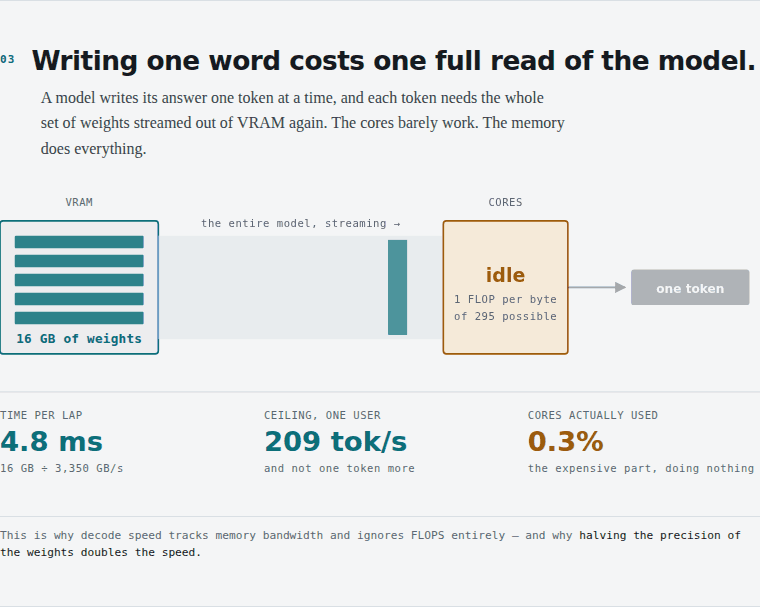
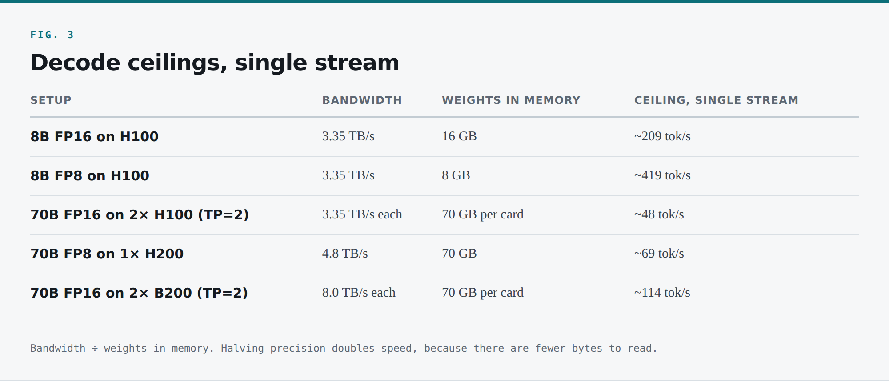
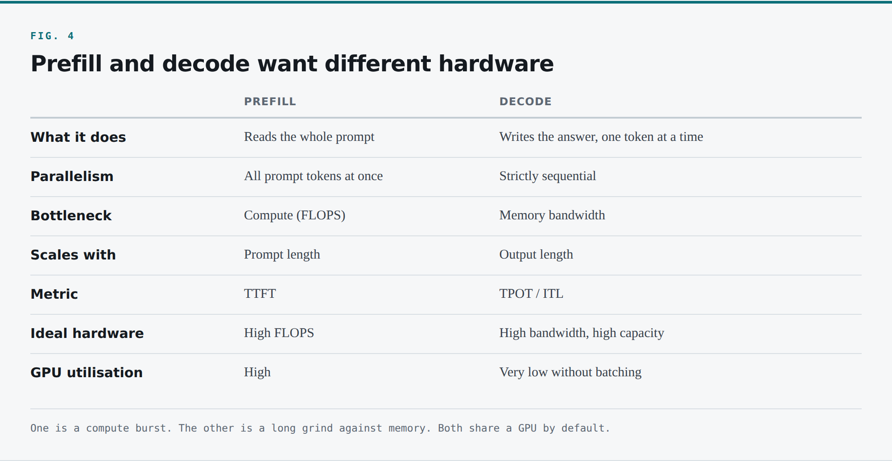
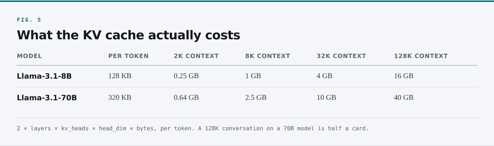
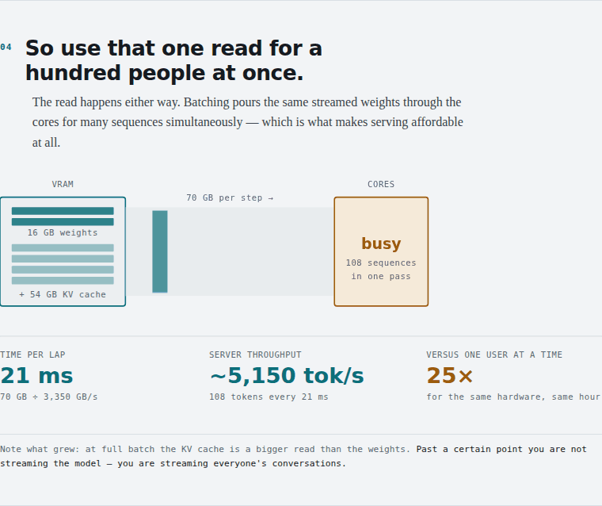
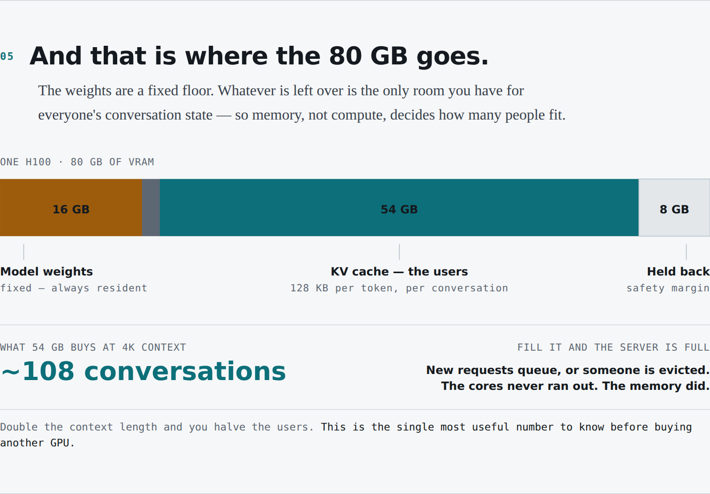
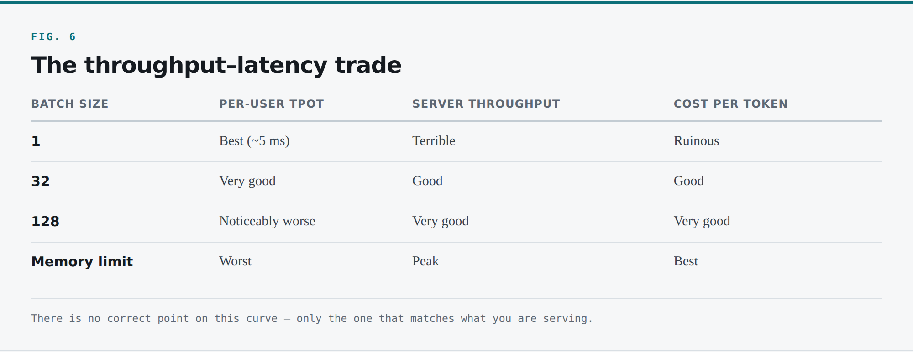

*Part 1 established the ground: a model is a large file of numbers, a GPU is fast because its memory sits next to its cores, and that memory is small. If you haven't read it, [start there](${series.part1.url}) — but the short version is enough to follow this piece.*

A model server is running. It holds the weights in VRAM and waits. Now let's look at what actually happens when a request arrives — because the answer explains almost every operational decision you will make later.

# 4. Tokens, and the two halves of every request

Before we go further, there is one word you need. You have heard it, and it is worth pinning down precisely because everything in this domain is measured in it.

## 4.1 Tokens

A language model does not read and write whole words the way we do. It breaks text into pieces called **tokens** — roughly three quarters of a word in English, sometimes a whole word, sometimes a fragment or a piece of punctuation. *"Serving LLMs is not like serving web apps."* is eight words but around ten tokens.

Everything is counted in tokens: what the model can read, what you pay, how fast it generates, every capacity number and every line on the bill. If you take one unit of measurement from this article, make it this one.

One practical note that matters more than it should: **tokenizers are model-specific, and non-English text tokenizes worse.** The same paragraph in Hindi or Japanese can cost two or three times what it costs in English. If you serve a multilingual product, your English-based benchmarks are flattering you.

## 4.2 The one trick

The model does exactly one thing: **given all the text so far, predict the next token.**

That is the whole mechanism. It takes your prompt, predicts one token, appends it, feeds the whole thing back in, predicts the next, and repeats until it produces a token meaning "done" or hits a length limit.

So a hundred-token answer is not one big calculation. It is that loop running **a hundred times**, one token per lap.

Which is exactly why the answer types itself out word by word. You are not watching an animation. You are watching each lap finish. Streaming is not a feature someone added; it falls out of the architecture for free.

Two consequences drop out immediately.

**These requests take a long time.** A normal web request is over in milliseconds. A few hundred output tokens means a few hundred laps of a loop that each take milliseconds to tens of milliseconds. Your duration histogram lives in the seconds, and every timeout, retry policy and load balancer setting in your stack was tuned for something a thousand times shorter.

**And no two requests are remotely the same size.** "What's the capital of France?" is seven tokens in, two out. "Summarise this 100-page contract" is fifty thousand in, two thousand out. Both hit the same endpoint with the same verb, and to anything in front of the server they look identical. One is four orders of magnitude more work.

Hold onto that. It is why load balancing breaks.

## 4.3 The pause and the stream

Paste a big chunk of text into a chat interface and hit Enter. There is a pause — a second, maybe several — where nothing appears. Then the answer starts and streams out steadily.

Those are the two halves of every request, and they are so different from each other that most of modern serving architecture exists to handle them separately.

### Half one: reading the prompt

Before the model can write a word it has to read everything you gave it. The key property: **your prompt is already there, in full.** Nothing to wait for. Every token can be processed at the same time.

So the whole model gets read out of VRAM once, and thousands of cores fire simultaneously to chew through the entire prompt in a single pass. That pass ends by producing the first token of your answer — the moment the pause ends and typing begins.

The duration comes down to one thing: **how much you gave it to read.** Seven tokens is one tiny pass with no perceptible pause. Fifty thousand tokens pushed through at once is a real wait.

This phase is **prefill**. The wait has a name too: **Time To First Token**, or **TTFT** — the metric users experience as "is this broken or is it thinking?"

Prefill is **compute-bound**. Enormous arithmetic on a large batch of tokens, with the weights read only once. The tensor cores are genuinely busy. This is the one phase where a GPU's FLOPS number earns its keep.

### Half two: writing the answer

Now the token-by-token loop begins, and each new token is one full pass through the model.

Here is where it gets uncomfortable. **To produce each new token, the GPU has to read the entire model out of its memory.** Writing a 200-token answer means streaming the whole model out of VRAM 200 times over, and each complete read buys exactly one token. The cores barely do any work. They are mostly waiting.

This phase is **decode**, and its speed is limited not by arithmetic but by **how fast the GPU can read its own memory**. The weights live in VRAM; the cores cannot hold them; so for every token the entire model streams out, gets used once, and makes way for the next pass.

That stream has a speed limit, and the arithmetic is beautifully simple:

> **Tokens per second (single sequence) ≈ Memory bandwidth ÷ Model size in memory**

Take an H100 at 3.35 TB/s and an 8B model at FP16, which is 16 GB:

```
3,350 GB/s ÷ 16 GB = ~209 tokens/second
```

That is the ceiling for one sequence on that card — the *theoretical maximum*, before attention, kernel launch overhead, or anything else. Real numbers land below it.

Benchmarks usually flip that around and quote the gap between one token and the next: `1 ÷ 209 = 4.8 milliseconds`. That gap is **TPOT** — Time Per Output Token, also seen as **ITL**, Inter-Token Latency. Every serving benchmark you will read is built on TTFT and TPOT.


*Every token costs one full read of the model out of VRAM.*

Some sanity checks with the same formula, which you can do in your head once you internalise it:



*Decode ceilings, single stream*

Look at rows one and two. **Halving the precision doubled the speed**, purely because there were fewer bytes to read — not because the cores got faster. Quantization is, first and foremost, a bandwidth optimisation. Worth saying out loud, because people reach for it to save capacity and are then surprised by the latency win.

## 4.4 The number that explains everything

Now that ridge point. During decode with a single sequence, for each parameter the GPU reads, it performs roughly two floating point operations — a multiply and an add. At FP16 each parameter is two bytes.

```
Arithmetic intensity = 2 FLOPs ÷ 2 bytes = 1 FLOP per byte
```

The H100's balance point is **295 FLOPs per byte**.

You are running at 1. **You are using roughly one third of one percent of the compute you paid for.**

That is the most expensive fact in this industry. During the phase where your GPU spends most of its wall-clock time, the tensor cores — the things the marketing is about, the things that cost tens of thousands of dollars — are almost entirely idle, waiting for memory.

This is not a bug in vLLM or a driver problem. It is arithmetic, and a property of what autoregressive generation *is*.

It also tells you exactly what to do. If your intensity is 1 and the machine wants 295, find roughly 295 times more arithmetic to do for the same bytes read. There is one obvious way: **read the weights once and use them for many sequences at the same time.**

That is batching. But first, the piece of state we have been quietly ignoring.

## 4.5 Summary of the two phases



*Prefill and decode want different hardware*

One is a one-time burst of computation. The other is a long, steady grind against memory. They want different things from your hardware — and right now they are both happening on the same GPU, taking turns.

Remember that last sentence. It is the seed of one of the most important optimisations in the stack.
---

### Key Takeaways
- Everything is counted in **tokens** — capacity, latency, and the invoice.
- Every request has two halves: **prefill** (compute-bound, sets TTFT) and **decode** (memory-bandwidth-bound, sets TPOT).
- Decode ceiling ≈ **bandwidth ÷ bytes read per step**. On an H100 with an 8B model: 3,350 ÷ 16 ≈ 209 tok/s, and not one token more.
- Arithmetic intensity during decode is **1 FLOP per byte** against a machine that wants 295. You are using ~0.3% of the compute you paid for.
- **Design rule:** halve the precision and you double decode speed — because there are fewer bytes to read, not because the cores got faster.


# 5. The KV cache — the hidden thing that makes it fast

There is a problem with what I just described.

If every new token requires a full pass over "all the text so far," and the text grows by one token each lap, then generating token 200 means reprocessing 199 tokens of history plus the prompt. Every lap would redo all the work of every previous lap. You would see a fresh pause before every single word, and the chat would be unusable.

That is not what happens. So what gives?

## 5.1 Saving the work instead of throwing it away

Prefill is the expensive step, but instead of throwing that work away the moment it is done, the model saves its intermediate results right there in GPU memory. That saved work is the **KV cache**.

The mechanics, briefly, without needing to understand attention properly: inside each transformer layer, each token produces a **key** and a **value** vector, and every subsequent token needs to look back at the keys and values of all the tokens before it. Those, once computed for a given token, never change. So you compute them once and keep them.

Prefill runs once and populates the cache. From then on, as the model writes the answer one token at a time, it does not repeat prefill. It reaches into the cache, reuses what it already worked out, and adds the new token's keys and values on top. You pay for the pause once, not before every word.

**This is the single most consequential piece of state in LLM serving.** It is why decode is fast. It is also why you run out of memory, why routing is hard, and why you cannot treat model servers as interchangeable.

## 5.2 How big is it, actually?

Infrastructure people need a number, not a concept. Here is the formula:

> **KV bytes per token = 2 × layers × kv_heads × head_dim × bytes_per_element**

The leading 2 is for K and V. Let's work two real examples.

**Llama-3.1-8B** — 32 layers, 8 KV heads (it uses grouped-query attention), head dimension 128, FP16:

```
2 × 32 × 8 × 128 × 2 bytes = 131,072 bytes = 128 KB per token
```

**Llama-3.1-70B** — 80 layers, 8 KV heads, head dimension 128, FP16:

```
2 × 80 × 8 × 128 × 2 bytes = 327,680 bytes = 320 KB per token
```

Now scale those to real conversations:



*What the KV cache actually costs*

Look at the bottom-right cell. **A single 128K-context conversation with a 70B model needs 40 GB of KV cache.** Half an H100, for one user — and the weights of that model need 140 GB and do not fit on the card in the first place.

This is why "we support a 1 million token context window" is a marketing statement with a brutal infrastructure invoice attached.

### The GQA footnote that saves you

Notice I used **KV heads**, not attention heads. Older models used Multi-Head Attention, where every attention head had its own key and value. Llama-3.1-70B has 64 attention heads but only 8 KV heads, because it uses **Grouped-Query Attention** — several query heads sharing one KV head.

That is an **8× reduction in KV cache size** for essentially no quality loss. Without it, that 128K conversation would need 320 GB rather than 40 GB, and long-context serving would not be economically viable.

So when evaluating a model for self-hosting, its KV geometry matters at least as much as its parameter count. Two 70B models can differ by a factor of eight in how many concurrent users they support. Check `num_key_value_heads` before you commit.

## 5.3 PagedAttention: why vLLM won

Early implementations allocated KV cache as one contiguous block per request, sized for the maximum possible output length. Allow 4,096 output tokens and every request reserved 4,096 tokens' worth of memory the instant it arrived — while most requests produce a couple of hundred and finish. The result was catastrophic internal fragmentation, with real systems wasting 60–80% of their KV memory on reservations never used.

vLLM's core contribution is **PagedAttention**, which applies the oldest trick in operating systems: instead of contiguous allocation, split the KV cache into fixed-size **blocks** (typically 16 tokens), keep a block table per sequence mapping logical positions to physical blocks, and allocate on demand as a sequence grows.

If you have ever explained virtual memory to a junior engineer, you already understand PagedAttention completely. It is paging. Blocks are pages, the block table is a page table, and the benefits are the same: near-zero fragmentation, and the ability to share physical pages between logical address spaces. That sharing is what makes shared prefixes cheap.

Practical consequence: **KV memory utilisation goes from ~30% to over 95%**, which translates almost directly into several times more concurrent users on the same card. This is why vLLM became the default, and why "we wrote our own serving loop" is usually a mistake.

## 5.4 What happens when you send a second message?

Everything above covers exactly one message. When your reply finishes, that request is done, and by default the cache for it is freed.

So what happens when you send the second message?

**The model remembers nothing between requests.** It is a pure function of the text you hand it. So your chat application resends the entire thread every time: first question, first answer, new message, all bundled into one request. And because the previous cache was freed, the server re-reads every word of that history from the beginning before it can reply.

The cost curve is quadratic in turns. Turn one prefills *n* tokens. Turn two, roughly 2*n*. Turn ten, roughly 10*n*. **The longer you talk, the longer you wait**, and your GPU spends an ever-increasing fraction of its time recomputing what it computed a minute ago.

## 5.5 Prefix caching

So: what if you just kept the cache?

You hang onto those blocks and label each by a hash of the token sequence that produced it. Turn two arrives, the server hashes the incoming prompt block by block, and discovers it has already done all of it except the newest message. That is the only part it has to prefill.

Turn ten now costs about what turn two costs. The pause stays small however long the conversation gets.

This is **prefix caching**, and in vLLM it is a flag:

```bash
vllm serve meta-llama/Llama-3.1-70B-Instruct \
  --enable-prefix-caching \
  --tensor-parallel-size 2
```

It is close to free when it hits and costs only a hash when it misses. In a chat workload it is one of the highest-return single flags in the whole stack.

Commercial APIs expose the same mechanism. Anthropic's prompt caching charges **1.25× the base input rate to write a cache entry and 0.1× to read one** — a 90% discount on cached input tokens. That pricing is not a promotion; it reflects the real cost difference between recomputing a prefix and reading it back from memory. When you see a tenfold price difference in an API, there is usually a tenfold resource difference underneath it.

## 5.6 The free lunch: shared prefixes across users

Once you are holding onto that saved work, something else falls out for free. The KV entries for a stretch of text depend only on the text before it. They do not know or care whose conversation they came from.

Suppose you have built an internal assistant and every conversation opens with the same 2,000-token block of system instructions — policies, tone guidance, tool definitions, retrieved company context. Same text every time, so the same KV blocks every time.

The server computes that prefix once and reuses it for **every person who talks to it**. With a thousand concurrent users you have stored one copy instead of a thousand, and skipped 2,000 tokens of prefill on 999 requests. Same mechanism as your own next turn — both just match on the beginning of the sequence — but the leverage is enormous.

It also hands you a design rule that makes your system meaningfully faster and cheaper for approximately zero engineering effort:

> **Put the stable, shared content at the front of your prompt and the variable, per-user content at the end.**

System prompt, then tool definitions, then retrieved documents, then conversation history, then the new user message. Anything that varies per request — a timestamp, a user ID, a session token — placed near the front destroys the shared prefix for every request behind it. A single `Current time: 2026-09-10T14:23:11Z` in the first line of a system prompt will take your cache hit rate to zero, and moving it to the end is a one-line change that can halve p95 TTFT.

## 5.7 The part that will hurt you

Here is the property that the whole of Part 3 exists to deal with:

**The KV cache lives in the VRAM of one specific GPU, inside one specific pod, on one specific node.**

Not in Redis. Not replicated. Not in a shared tier by default. Physically resident on a particular card.

Which means the server that handled your last message is not merely *a* good place to send your next one. It is, by a wide margin, the *only* place where your next message is cheap. Send it anywhere else and you pay full prefill again.

You have just acquired **session affinity as a performance requirement**, in a system that presents a completely stateless HTTP interface to the outside world.

If you have ever operated a system where the load balancer was unaware of a cache that mattered — and if you have been doing this a while, you have — you already know how this ends.
---

### Key Takeaways
- The **KV cache** is why decode is fast and why you run out of memory. Both.
- Cost is exact: **2 × layers × kv_heads × head_dim × bytes** per token. Llama-3.1-8B = 128 KB/token; 70B = 320 KB/token.
- **GQA is an 8× saving** on that number. Check `num_key_value_heads` before you commit to a model — two 70B models can differ eightfold in how many users they hold.
- **PagedAttention is virtual memory applied to attention.** Utilisation goes from ~30% to >95%.
- **Design rule:** put stable content at the front of the prompt and variable content at the end. A timestamp in line one takes your cache hit rate to zero.
- **Trade-offs & Failure Modes:** the cache lives in one GPU's VRAM, in one pod, on one node. You have just acquired session affinity as a performance requirement inside a stateless interface.


# 6. Batching — how one GPU serves many people

Go back to the expensive part of writing an answer. For every token it produces, the GPU reads the entire model out of memory. That read is the real cost, and it is fixed.

Which unlocks the economics of this entire industry:

**If the GPU already has to read the whole model to produce one token for one user, why not use that same read to produce the next token for a lot of users at once?**

One read of the weights gives you one token for one user — or fifty tokens for fifty users. Same single read either way.

That is **batching**. You pack many people's requests together and run them as one group. Each person's answer still arrives at roughly the speed it would have alone, but the server's total output — its **throughput** — goes up almost linearly with batch size, right up until you hit a wall. You serve fifty people for something close to the cost of serving one.

Without batching you would pull the entire model out of VRAM for one person at a time, and nobody could afford to run this hardware that way. **Batching is not an optimisation. It is what makes inference economically possible at all.**


*The same read, now serving 108 sequences. Note that the KV cache becomes the larger read.*

## 6.1 Continuous batching

The naive version — **static batching** — collects a group of requests, runs them until they *all* finish, then starts the next group. But requests finish at wildly different times: one person asked for two tokens, another for two thousand. The short request's slot then sits idle for the entire remaining life of the longest request in the batch, and your effective batch size collapses towards one.

**Continuous batching** — iteration-level scheduling — fixes this. The scheduler operates per decode step, not per request. When a sequence finishes, its slot is freed *immediately* and a queued request takes its place on the very next iteration. Requests join and leave continuously. This alone is worth several times the throughput of static batching on realistic traffic, and it is why the scheduler inside vLLM is a real scheduler with a queue and an admission policy, not a for-loop.

Two refinements you will meet in config flags:

**Chunked prefill.** A long prefill blocks the decode loop for everyone else — one person pasting 50,000 tokens freezes thirty other people's output mid-sentence. Chunked prefill splits it into pieces interleaved with decode steps, trading slightly worse TTFT for that one request against dramatically better tail latency for everybody else. `--enable-chunked-prefill`; on by default in recent versions. Leave it on.

**Preemption.** Under memory pressure the scheduler evicts a running sequence, swapping its KV blocks to host memory or recomputing them later. `Sequence group ... is preempted` in your logs is your server telling you it is oversubscribed. Alert on it.

## 6.2 Why not batch a million users?

Memory, and it is the ceiling on how far this goes.

Every user in the batch needs their own KV cache, resident in GPU memory for as long as they are served. That memory is small to begin with and most of it is already gone — the weights sit in it permanently. Whatever is left is the *only* room you have for everyone's cache.

Fill it and the server is full. New requests queue, or somebody's cache gets evicted. That is exactly what is happening when a chat product tells you it is at capacity.


*Where 80 GB goes. The cores never run out — the memory does.*

Notice what is *not* the problem. **It is not the processor that runs out.** There is plenty of arithmetic left in those cores — a fraction of a percent used at batch size one, and even at high batch they are not the constraint. Memory runs out. Memory decides how many people one GPU serves.

This is where a great deal of money gets wasted. Teams look at GPU utilisation, see a reasonable-looking number, and buy more cards — when what they needed was a smaller KV footprint, a shorter max context length, or a quantized model.

## 6.3 The capacity equation

Here is the arithmetic. This is the calculation I would want any engineer joining an inference platform team to be able to do on a whiteboard.

> **KV budget = (Total VRAM × utilisation) − weights − activation & framework overhead**
>
> **Max concurrent tokens = KV budget ÷ KV bytes per token**
>
> **Max concurrent sequences = Max concurrent tokens ÷ average sequence length**

Work it through for Llama-3.1-8B at FP16 on a single 80 GB H100:

```
Total VRAM                                    80 GB
× gpu-memory-utilization 0.90                 72 GB
− model weights (8B × 2 bytes)              − 16 GB
− activations, CUDA graphs, framework        −  2 GB
─────────────────────────────────────────────────────
KV cache budget                               54 GB

54 GB ÷ 128 KB per token          = ~442,000 tokens of KV
442,000 ÷ 4,096 avg tokens/seq    = ~108 concurrent sequences
```

So that one card supports roughly a hundred concurrent conversations at 4K context. Not a thousand. About a hundred — and if average context doubles to 8K, about fifty.

vLLM tells you the equivalent at startup, in a log line worth grepping for:

```
INFO ... # GPU blocks: 27648, # CPU blocks: 4096
INFO ... Maximum concurrency for 8192 tokens per request: 54.00x
```

Each block is 16 tokens, so 27,648 blocks is 442,368 tokens — the number we just calculated by hand. When those two disagree, something is wrong with your mental model or your config, and it is worth finding out which.

## 6.4 The throughput ceiling, honestly

Now what that batch actually produces, because there is a trap here.

The naive version: one weight read per decode step, 16 GB at 3.35 TB/s, so 4.8 ms per step, so 108 tokens every 4.8 ms — about **22,500 tokens per second**. Wonderful, and wrong.

During attention, every sequence must read **its own entire KV cache** on every decode step. So the bytes moved per step are not just the weights:

```
weights + total KV cache in the batch
```

At full occupancy, that KV cache is 54 GB. So:

```
(16 GB weights + 54 GB KV) ÷ 3.35 TB/s = ~21 ms per step
108 tokens ÷ 0.021 s = ~5,150 tokens/second
```

Four times lower than the naive estimate, and note what changed: **at high batch and long context, reading the KV cache costs more memory traffic than reading the weights.** It stops being a footnote and becomes the dominant term.

That is why FlashAttention and its descendants matter, why KV cache quantization (storing K and V at FP8) is a real lever, and why TPOT degrades as your batch fills. It is also why a benchmark at batch size 8 tells you almost nothing about batch size 100.

## 6.5 The throughput–latency trade you are actually making

Every knob in this space is a trade between these two, and it is not subtle:



*The throughput–latency trade*

There is no universally correct point on that curve. An interactive chat product needs TPOT under about 30 ms — slower and the text visibly crawls relative to reading speed — so it runs at moderate batch and accepts higher cost per token. A batch document pipeline has no human waiting, so it should run at maximum batch and cut cost per token by three or four times.

**Running both on the same pool with the same settings is a common and expensive mistake.** Interactive users get poor latency and the batch job gets poor economics. Split them into separate pools. This is the same instinct as separating OLTP from OLAP, and correct for the same reasons.

## 6.6 Goodput, not throughput

Raw throughput is a vanity number. You can always increase tokens per second by cranking batch size until every user's experience is unacceptable. What you care about is **goodput**: tokens per second delivered *within your latency SLO*.

Define it explicitly — *requests whose TTFT is under 1 second and whose TPOT stays under 30 ms* — then measure the token rate of only those. That is the number to optimise, to autoscale on, and to plan capacity against.

A server at 8,000 tokens/second where 40% of requests miss their SLO is performing worse than one at 5,500 where 99% hit it. Throughput says otherwise. Throughput is lying to you.
---

### Key Takeaways
- **Batching is not an optimisation — it is what makes inference affordable at all.** One weight read serves the whole batch.
- Capacity is a calculation you can do on a whiteboard: `(VRAM × util) − weights − overhead ÷ KV per token ÷ avg context`. One H100 + 8B at 4K ≈ **108 concurrent conversations**.
- At full batch the **KV cache is a bigger read than the weights** (54 GB vs 16 GB), so the step stretches from 4.8 ms to 21 ms. Benchmarks at batch 8 tell you nothing about batch 100.
- **Optimise goodput, not throughput** — tokens/second delivered inside your SLO. Throughput alone will lie to you.
- **Trade-offs & Failure Modes:** interactive and batch workloads on one pool means bad latency for one and bad economics for the other. Split them.


---

One GPU, roughly a hundred concurrent conversations, and a hard ceiling set by memory rather than compute.

But some models don't fit on a single card at all, one server never serves the world, and the load balancer you would reach for by instinct actively makes things worse. **Part 3** scales this out to a fleet.

**Next: [Part 3 — The Fleet](${series.part3.url})**