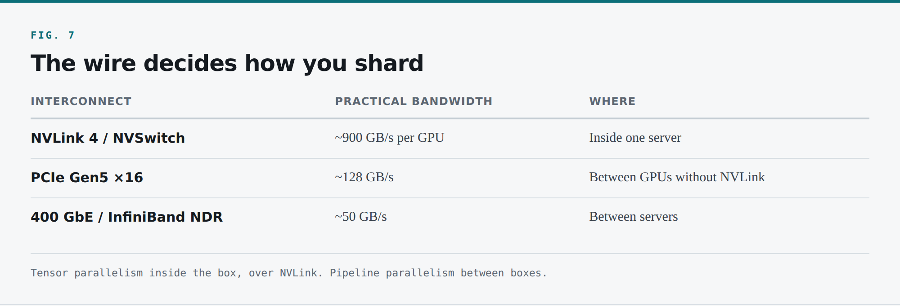
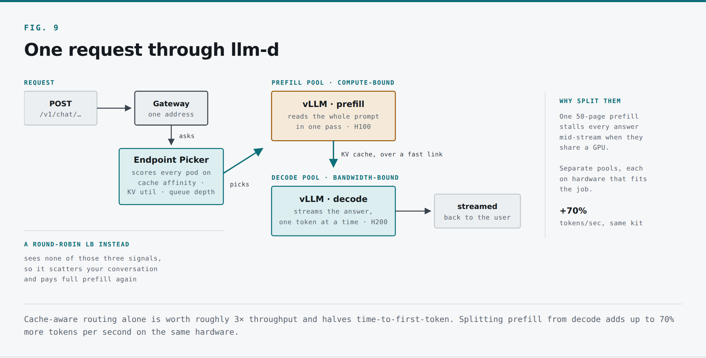
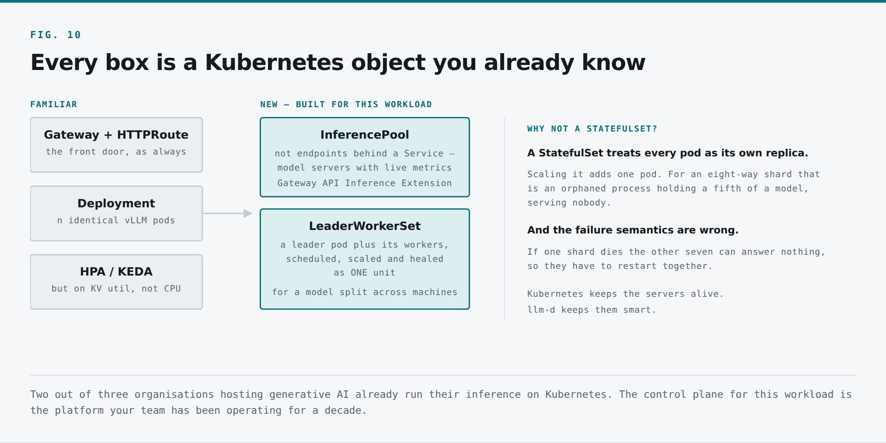
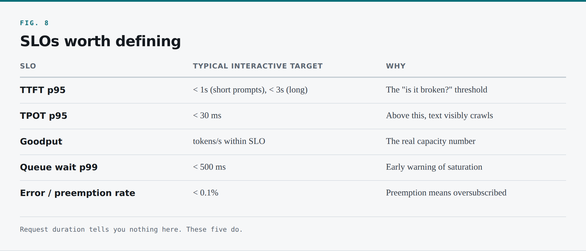

*This is the last of three parts. [Part 1](${series.part1.url}) covered the hardware; [Part 2](${series.part2.url}) took a single request apart. Here we go from one server to a fleet.*

Everything so far has assumed one server holding one model. That is where the easy part ends.

# 7. When the model doesn't fit — sharding

Every server we have discussed holds the whole model by itself. That does not work for the biggest ones. A 70B model at FP16 needs 140 GB of weights; an H100 has 80. It does not fit.

So you bring in several GPUs, slice the model into pieces, and put one piece on each card. No single GPU holds the whole thing; together they do. vLLM does this for you:

```bash
vllm serve meta-llama/Llama-3.1-70B-Instruct \
  --tensor-parallel-size 4
```

Point it at the model, tell it how many GPUs it has, done. But *how* it splits matters enormously, and choosing wrong costs you a factor of two or three in latency for no benefit.

## 7.1 What we're actually cutting

A model is a stack of layers. Your prompt enters at the top and flows down, one layer at a time, each doing a large pile of multiply-and-add and passing its result to the layer below, until the last one produces a token.

There are two natural places to cut.

### Across layers: pipeline parallelism

Hand the first twenty layers to GPU 1, the next twenty to GPU 2. Data flows in sequence — GPU 1 does its layers and passes one intermediate activation tensor, a few megabytes, to GPU 2. Communication is small and infrequent: one handoff per stage boundary, per token.

The downside is bubbles. While GPU 2 works, GPU 1 idles unless you keep feeding it. Pipeline parallelism needs a healthy stream of concurrent requests to keep every stage busy, and adds latency proportional to the number of stages.

### Inside each layer: tensor parallelism

Split the matrix itself. GPU 1 computes one half of a layer's output, GPU 2 the other, and the halves combine into that layer's result. Every GPU works on every token, all the time. No bubbles, lower latency.

The cost is chatter. Combining the halves requires an **all-reduce** — every GPU exchanging and summing partial results — and a transformer layer needs roughly two. For an 80-layer model that is around **160 collective operations per token.**

## 7.2 The wire decides which one you use

Where you physically put those GPUs determines which cut makes sense, and it comes down to the speed of the wire between them.



*The wire decides how you shard*

Roughly a **7× gap** between NVLink and PCIe, and **18×** between NVLink and a fast network — before protocol overhead and latency, which make the effective gap wider still.

Concretely: a 70B-class model with hidden size 8,192, decoding at batch 64 in FP16. Each all-reduce moves a couple of megabytes; across 160 of them, roughly 300 MB of collective traffic per decode step.

```
Over NVLink at 900 GB/s :  ~0.4 ms per step  →  negligible
Over Ethernet at 50 GB/s:  ~6.7 ms per step  →  larger than the entire compute
```

Your TPOT budget was perhaps 20 ms. Tensor parallelism over the network would consume a third of it in pure communication, and that is optimistic — collectives are latency-sensitive and the real penalty is worse.

Hence the rule, and it is close to absolute:

> **Keep the chatty split inside the box. Keep the light split between boxes.**
>
> **Tensor parallelism within a node, over NVLink. Pipeline parallelism across nodes.**

Pack eight GPUs into one server on the fast link and they serve as if they were one very large GPU. That is how most large models run today, and why the unit of purchase in this industry is an 8-GPU node rather than a GPU.

```bash
# 70B across 4 GPUs in one node — all TP, over NVLink
vllm serve meta-llama/Llama-3.1-70B-Instruct --tensor-parallel-size 4

# A very large model across 2 nodes of 8 GPUs each
vllm serve some-org/very-large-model \
  --tensor-parallel-size 8 --pipeline-parallel-size 2
```

## 7.3 Practical rules for choosing TP size

**TP size must divide your attention head count.** 64 heads means TP of 2, 4 or 8 is fine; 6 is not.

**Do not use more GPUs than you need.** Every additional rank adds collective overhead. If a model fits comfortably on two cards, running it on four usually makes it *slower* per request — you added communication without removing a bottleneck. The reason to go beyond the fit threshold is to buy KV headroom for more concurrent users, and that should be a deliberate trade.

**Weights split, but not everything does.** Each rank holds `total_weights / TP`, and the KV cache splits along the head dimension too, so TP buys both capacity and aggregate bandwidth. Activation memory and framework overhead do not shrink, so do not expect linear scaling in your capacity equation.

**Quantization is often the cheaper answer.** Before reaching for a second GPU, ask whether FP8 will do. A 70B at FP8 is 70 GB and fits on a single H200 with 71 GB left for KV cache — one card, no collectives, no cross-GPU failure domain. Against TP=2 at FP16, the single quantized card is frequently both faster and half the price, for an accuracy cost typically in the low single digits of a percent. Measure it on *your* evaluation set, but do not assume the answer is no.

## 7.4 Expert parallelism, briefly

Frontier models are increasingly **Mixture-of-Experts**: many "expert" networks per layer with a router that activates only a couple per token. The consequence is a strange memory profile — 500B total parameters, all of which must be resident in VRAM, but only ~30B *active* per token. Capacity tracks the total; bandwidth tracks the active subset.

That produced a third parallelism axis, **expert parallelism**, where experts live on different GPUs and tokens are routed to whichever GPU holds the one they need. It also creates a load balancing problem *inside the model*, since expert selection is data-dependent and some experts are far more popular than others.

You need to recognise the shape when someone says "wide EP," and to know that llm-d treats MoE scaling with wide expert parallelism as a supported deployment recipe.

## 7.5 What sharding gives you, and what it doesn't

Sharding solves the *fitting* problem. It does not solve the *serving the world* problem — you still have one logical server. And it introduces something Kubernetes was not originally designed for: **a group of pods that are not replicas of each other.**

Those eight pods are eight pieces of one thing. If one dies, the other seven cannot answer anything at all — a model missing a fifth of its layers produces nothing. They must start together, be scheduled with awareness of each other, and be scaled and healed as a **unit**.

Hold that thought. It becomes a specific Kubernetes object shortly.

---

### Key Takeaways
- Sharding solves **fitting**, not serving. A 70B at FP16 needs 140 GB; an H100 has 80.
- **Design rule: keep the chatty split inside the box, the light split between boxes.** Tensor parallelism over NVLink (~900 GB/s), pipeline parallelism over the network (~50 GB/s).
- The arithmetic is brutal: 160 collectives per token costs 0.4 ms on NVLink and 6.7 ms over Ethernet — a third of your entire TPOT budget.
- **Before adding a second GPU, try FP8.** A 70B at FP8 fits one H200 with 71 GB left for KV cache — one card, no collectives, frequently faster and half the price.
- **Trade-offs & Failure Modes:** every extra TP rank adds collective overhead. More GPUs than you need makes requests *slower*, not faster.


# 8. Why your load balancer makes things worse

A real service is never one server. You want to serve the whole world, so you need a fleet — each member its own expensive GPU carrying its own full copy of the model.

How does a request get to one of them?

If you have worked in infrastructure you already have a fix in mind. Put a load balancer in front, spread requests evenly, round and round. We have balanced web traffic this way for decades.

For LLM serving it is the wrong move, for two independent and severe reasons.

## 8.1 Reason one: it destroys the cache

I send my first message. It lands on server 2, which reads my conversation and builds its KV cache in VRAM.

I send my second message. The load balancer's entire job is to spread traffic evenly, so it sends this one to server 5 — which has never seen me, has nothing saved, and re-reads my entire conversation from scratch.

A load balancer treats every backend as interchangeable. **We know they are not.** So it throws away perfectly good work, on the most expensive hardware you own.

The cost is not marginal. In a chat workload with a shared system prompt and multi-turn conversations, cache-aware routing delivers around **three times the output throughput and roughly halves TTFT on identical hardware** — llm-d's published numbers, and consistent with what the arithmetic predicts. Round-robin is not neutral. It is costing you two thirds of your fleet.

## 8.2 Reason two: requests are not the same size

A load balancer assumes every request is roughly equivalent, so spreading requests evenly also spreads *load* evenly. That holds beautifully for web traffic. It is catastrophically false here.

One request is "hi" and the next is "summarise these fifty pages." To the load balancer they are identical — same URL, same method, same headers. So it happily sends the fifty-page request to a server already streaming answers to thirty other people. All thirty slow down, and the big request takes far longer than it should, now sharing a bandwidth-bound decode loop with a full batch.

This is **head-of-line blocking**, and it is worse here than almost anywhere because request cost varies across four orders of magnitude. Queueing theory is clear that when service times have high variance, round-robin assignment produces terrible tail latency — you need size-aware routing or a shared queue. Round-robin gives you neither.

## 8.3 What the load balancer cannot see

The deeper problem is that everything the router needs to know lives *inside* the servers, where an L4 or L7 proxy cannot see it:

- **How full is each server's KV cache right now?** This is the actual capacity signal, and it does not correlate with request count or CPU.
- **Whose saved work is sitting where?** This is the affinity signal.
- **How long is each server's queue, and what is in it?** A server with two queued requests might be more loaded than one with ten, if those two are enormous.
- **Is this server mid-way through a large prefill?** If so, sending it anything right now is a bad idea.
- **What is this server's current running batch size, and is it preempting?**

None of that is visible from outside. Connection counts do not reveal it. Request rate does not reveal it. CPU utilisation — the metric your HPA is almost certainly configured on — is *completely* uncorrelated with it, because the CPU on a GPU serving node is idle no matter what the GPU is doing.

## 8.4 So what would a correct router do?

Enumerate the requirements and the design writes itself:

1. **Know where cached prefixes live**, and prefer the server holding this conversation's prefix.
2. **Read real load from the servers themselves** — KV utilisation, queue depth, running batch size — rather than inferring it from connection counts.
3. **Balance affinity against load.** Blindly honouring affinity turns one popular server into a hotspot; blindly balancing load destroys cache locality. The answer is a weighted score, and the weights are workload-dependent.
4. **Understand that prefill and decode are different work**, and send them to different places.
5. **Handle streaming responses** that stay open for tens of seconds.
6. **Enforce fairness**, so one client cannot consume the whole fleet's KV budget.

That is not a load balancer. That is a **scheduler** — closer to a batch job scheduler or a query planner than to nginx.

The whole problem, summarised, because this is the wall the entire industry hit at once:

> The model barely fits in memory. Every token forces a full re-read of it. The saved work that makes it fast is stranded on one specific card. Memory — not compute — caps how many people that card serves. Requests vary in cost by four orders of magnitude. And if you get routing wrong on top of that, you waste the most expensive hardware you own.

Every team serving models at scale hit that wall independently. Which is why Red Hat, Google, IBM and NVIDIA decided to solve it together, in the open.
---

### Key Takeaways
- Round-robin routing **destroys cache locality** and costs roughly two thirds of your fleet: cache-aware routing delivers ~3× throughput and halves TTFT on identical hardware.
- Request cost varies across **four orders of magnitude**. Even assignment does not mean even load.
- A load balancer cannot see KV utilisation, queue depth, running batch size, or where your conversation lives — and **CPU, the metric your HPA watches, is completely uncorrelated** with GPU load.
- **What you actually need is a scheduler**, closer to a query planner than to nginx.


# 9. llm-d — a brain for the fleet

**llm-d is an open source, Kubernetes-native stack for distributed LLM inference.** It is a CNCF Sandbox project under Apache 2.0, with contributions from Red Hat, Google, IBM, NVIDIA and a long list of others.

At its heart it is a smart router in front of your entire fleet. When a request arrives, it does not throw it at whichever server is next in rotation. It stops, considers where that request *should* go, and sends it to the server best equipped to handle it.

To make that call it looks at three things: **what saved work each server is holding, how much memory each has free, and how long each one's queue is.**

## 9.1 What it actually does

**Cache-aware routing.** llm-d maintains an index of which server holds which prefixes. Your next message goes straight back to the server that already has your conversation, which skips the re-read. Worth roughly **3× output throughput and 2× faster TTFT on identical hardware.** Two flavours: an approximate mode that estimates locality from routing history with no coordination overhead, and a precise mode where servers report their actual cached blocks to a shared index — more machinery, better hit rates on less predictable traffic.

**Load-aware scheduling.** The router reads live signals from inside each server — KV utilisation, queue depth, running batch size — via the metrics model servers already expose, and sends your request somewhere that genuinely has room. There is also a latency-predictor variant that trains an online XGBoost model to estimate how long a request will take on a given server, and routes to minimise predicted latency.

**Prefill/decode disaggregation.** This is the one I find most elegant, and it comes directly from the observation Part 2 ended on.

Prefill is compute-bound. Decode is memory-bandwidth-bound. On a shared GPU they take turns, and when someone pastes in fifty pages that one enormous prefill stalls everyone else's answer mid-stream.

llm-d can split them into **separate pools** — one doing nothing but prefill, the other nothing but decode, each on hardware that suits its job. You might put prefill on H100s for the FLOPS and decode on H200s for the memory and bandwidth. When a prefill server finishes a prompt, it transfers the KV cache across a fast link to a decode server, which streams the answer.

Reported gain: **up to 70% more tokens per second on the same hardware**, with a tail latency improvement larger than that number suggests, because the interference between the two phases is gone entirely.

It is the same instinct as separating your write path from your read path, or your batch tier from your interactive tier. You have made this call before.

**Tiered caching and KV offload.** VRAM is the fast tier but not the only place a KV cache can live. llm-d supports offloading colder blocks to host memory and remote stores, so a conversation that goes quiet for two minutes need not be fully recomputed. A cache hierarchy, with the trade-offs every cache hierarchy has ever had.

**Flow control and fairness.** With a shared KV budget, one client sending very long requests can starve everyone else. llm-d includes admission control and fairness mechanisms. If you have implemented per-tenant rate limiting on a shared database, you know the shape.

**Autoscaling.** Standard HPA/KEDA integration plus a workload-variant autoscaler that scales on inference-appropriate signals rather than CPU.

## 9.2 It runs on Kubernetes, and that is the point

llm-d sits on top of something you are almost certainly already running.

Per CNCF's 2025 Annual Cloud Native Survey — cited in their post *The Future of AI is Community Driven and Open* — **66% of organisations hosting generative AI use Kubernetes to manage some or all of their inference workloads.** Two out of three. Meanwhile 82% of container users run Kubernetes in production.

This is the part I most want infrastructure engineers to hear. The de facto control plane for AI inference is the platform you have been operating for a decade. Not a new one, not a vendor appliance. Kubernetes, with some new object types and a smarter router.

## 9.3 The architecture, concretely

Start with what you have: a Kubernetes cluster with worker nodes, some with GPUs and a device plugin exposing them.

**Model servers.** Each is a vLLM (or SGLang) instance — the same server we started in Part 1 — running as a pod on whichever node has a free accelerator. A group of identical ones is a Deployment. With disaggregation you have two: a prefill pool and a decode pool.

**An InferencePool.** Here it stops looking like ordinary Kubernetes. `InferencePool` is a resource from the **Gateway API Inference Extension**, a Kubernetes SIG project. It groups model server pods serving the same base model into something the routing layer can reason about — not generic endpoints behind a Service, but model servers with known capabilities and live performance metrics.

**A Gateway and an Endpoint Picker.** Out front, a Gateway gives one address for the whole fleet. Behind it sits the **Endpoint Picker (EPP)** — the small brain holding the cache-aware and load-aware logic. The gateway receives the request; the EPP decides which pod gets it. llm-d ships `llm-d-router` as a production EPP.

That separation matters: the data plane is a standard high-performance L7 proxy, and the intelligence is a pluggable component it consults. You can swap scoring policies without touching the proxy.


*One request through llm-d: the gateway receives it, the endpoint picker scores every pod, prefill hands the KV cache to decode.*

## 9.4 LeaderWorkerSet: the object for sharded models

A model sharded across eight GPUs is not eight replicas. It is one thing in eight pieces.

Your first instinct is probably a StatefulSet — stable identities, fixed startup order, useful for a database cluster that must come up in sequence. But a StatefulSet still treats every pod as **its own replica**. Scaling adds one pod, which for a sharded model is meaningless: a ninth pod on an eight-way shard is an orphaned process holding a fragment, serving nobody. And the failure semantics are wrong — if one shard dies, the other seven can answer nothing, so they must restart *together*.

So Kubernetes gained a new object: **LeaderWorkerSet (LWS)**. A leader pod plus its workers, treated as one replicated unit — scheduled, scaled and healed together. Scaling up creates another whole group; a failure restarts the whole group. llm-d recommends LWS 0.7.0 or newer for multi-node deployments.

This is a good example of Kubernetes absorbing a new workload class. Someone identified that the existing primitives could not express "these pods are one thing," and rather than papering over it with operators and glue, the community added the primitive.

## 9.5 Describing it all

Every box in that architecture is a standard Kubernetes object, and you describe the whole thing in a values file passed to Helm:

```yaml
# values.yaml — illustrative shape, check the current chart for exact keys
modelArtifacts:
  uri: "hf://meta-llama/Llama-3.1-70B-Instruct"

decode:
  replicas: 6
  parallelism:
    tensor: 4
  extraArgs:
    - "--enable-prefix-caching"
    - "--max-model-len=32768"
    - "--gpu-memory-utilization=0.92"

prefill:
  replicas: 2
  parallelism:
    tensor: 4
  extraArgs:
    - "--enable-chunked-prefill"

routing:
  proxy:
    connector: nixl        # KV transfer between prefill and decode
  inferencePool:
    scoring:
      prefixCacheWeight: 3
      queueWeight: 2
      kvUtilWeight: 2
```

Swap that file and you get a different fleet. Apply it and llm-d creates the prefill pods, the decode pods, the gateway and the EPP, and wires them together.

Installation is broadly two Helm operations: one for the routing infrastructure — gateway, EPP, InferencePool machinery — and one for a model and its serving pools. Chart names and flags move faster than any article can track, so take the current quickstart from the project rather than from me.

## 9.6 Well-lit paths

The hardest part of adopting any of this is tuning it. Everything we have discussed has a real knob behind it. How strongly should the router favour a server holding your cache over one that is less busy? Do you split prefill from decode, and how many of each? How many GPUs does one model copy span? What is `max-model-len`, and what does it do to your KV budget? What precision, and does KV quantization pay for itself here?

Every one of those moves both speed and cost, and the right answer depends on your model, hardware and traffic. Tune them by hand and you will spend weeks and still get several wrong.

llm-d's answer is **well-lit paths**: tested deployment recipes where every knob is already set and measured on real hardware. The current set covers optimised baseline, latency-predicted routing, precise prefix-cache-aware routing, tiered prefix caching, prefill/decode disaggregation, MoE scaling with wide expert parallelism, flow control and fairness, and inference pool autoscaling.

Three carry most of the story, and you already understand each:

**1. Optimised baseline.** One pool of identical servers with cache-aware routing on and nothing else changed. Where almost everyone should start — smallest change, largest payoff.

**2. Prefill/decode disaggregation.** Two pools sized for your traffic, with KV transfer between them. The path for long, heavy prompts.

**3. Wide parallelism.** A single model across a group of GPUs acting as one server, via LeaderWorkerSet. What the giants need.

The router stays the same across all three. What changes is the shape of the fleet behind it.

## 9.7 Operating it feels familiar

Once up, the operational loop is one your team already trusts. Every server is a pod. A pod crashes, Kubernetes restarts it. A node dies, Kubernetes reschedules. Because prefill and decode are separate pools you scale each independently — decode pods when answers back up, prefill pods when prompts get heavy.

**Kubernetes keeps the servers alive. llm-d keeps them smart.**


*Every box is a standard Kubernetes object — plus two new ones built for this workload.*

And you use it as you would any service. llm-d hands you a single address sitting in front of every prefill pod, every decode pod, and every sharded giant. You never call a pod directly, any more than you would call a web app's pod directly.

```bash
curl http://inference-gateway.llm-d.svc/v1/chat/completions \
  -H "Content-Type: application/json" \
  -d '{"model": "llama-3.1-70b", "messages": [...], "stream": true}'
```

Same OpenAI-compatible API as the single server back in Part 1. Your application code does not change at all.

To trace one request through everything we have built: it hits the gateway. The endpoint picker scores the available pods on cache affinity, KV utilisation and queue depth, and selects one. A prefill pod reads the prompt in a single compute-heavy pass, and hands the resulting KV cache across a fast link to a decode pod. That decode pod streams the answer one token at a time, re-reading the weights out of VRAM on every step, batched together with dozens of other users' sequences. And if the model happened to be a giant, a whole LeaderWorkerSet of GPUs across several machines did that work together as one.

The project lives at **llm-d.ai**.
---

### Key Takeaways
- **llm-d** is a CNCF Sandbox project (Red Hat, Google, IBM, NVIDIA) for Kubernetes-native distributed inference.
- **Cache-aware routing:** ~3× output throughput, 2× faster TTFT, no hardware change.
- **Prefill/decode disaggregation:** up to **70% more tokens/sec** on the same kit, by giving each phase the hardware it actually wants.
- **66% of organisations hosting generative AI already run inference on Kubernetes** (CNCF 2025 survey). The control plane for this workload is the platform your team has operated for a decade.
- **LeaderWorkerSet** exists because a sharded model is one thing in eight pieces, not eight replicas — StatefulSet gets both scaling and failure semantics wrong.
- **Design rule:** start with the optimised-baseline well-lit path. Smallest change, largest payoff.


# 10. Running it — the parts nobody puts in the tutorial

Everything so far is architecture. This is the operational reality, where the SRE instinct earns its money.

## 10.1 SLOs that mean something

Inference needs its own SLO vocabulary. Request duration is nearly useless — a ten-second request might be a healthy long generation or a pathologically slow short one, and the histogram cannot tell you which.



*SLOs worth defining*

Two notes. **Segment TTFT by prompt length** — one TTFT SLO across a workload where prompts range from 50 to 50,000 tokens is meaningless. And **measure TPOT, not average tokens/second over the request**, because the average hides the mid-stream stalls users actually notice.

## 10.2 What to scrape

vLLM exposes Prometheus metrics on `/metrics`. The ones that matter:

```
vllm:gpu_cache_usage_perc              # THE capacity signal
vllm:num_requests_running              # current batch size
vllm:num_requests_waiting              # queue depth
vllm:time_to_first_token_seconds       # TTFT histogram
vllm:time_per_output_token_seconds     # TPOT histogram
vllm:prefix_cache_hit_rate             # routing effectiveness
vllm:num_preemptions_total             # memory pressure
```

Plus, from DCGM exporter on the nodes: `DCGM_FI_DEV_GPU_UTIL`, `DCGM_FI_DEV_FB_USED`, `DCGM_FI_DEV_GPU_TEMP`, `DCGM_FI_DEV_POWER_USAGE`, and the ECC and XID error counters.

Three traps worth naming.

**GPU utilisation lies.** `DCGM_FI_DEV_GPU_UTIL` reports the percentage of time at least one kernel was resident. During memory-bound decode that reads 90%+ while the tensor cores do essentially nothing — a card can show 95% "utilisation" at 3% of its actual FLOPS. Use KV utilisation and goodput as your real signals; treat GPU util as liveness, not capacity.

**Node CPU is meaningless here.** Your default HPA is almost certainly watching it. It sits at 5% while the GPU is saturated.

**Prefix cache hit rate is a routing metric, not a model metric.** If it drops, look at your router and at recent prompt-template changes.

## 10.3 Autoscaling, and why your instincts are wrong

Three properties break normal autoscaling:

1. **Cold start is minutes.** Pod scheduling, a multi-gigabyte image pull, weight download, CUDA graph capture. By the time your new replica is ready, the spike is over.
2. **The unit of scale is a whole GPU**, or with sharding a whole node. There is no adding 20% more capacity.
3. **CPU and RPS do not correlate with load.** RPS is nearly useless when request cost varies by four orders of magnitude.

What works:

**Scale on KV cache utilisation and queue depth.** A KEDA or custom-metrics HPA targeting ~70% `gpu_cache_usage_perc`, with queue depth as a secondary trigger, reflects reality.

**Pre-warm aggressively.** Because you cannot react, you must anticipate. Size headroom to your cold start time multiplied by your fastest realistic ramp: if traffic can double in five minutes and a pod takes four minutes to become ready, you need standing headroom to absorb four minutes of growth. That headroom is not waste; it is your latency SLO.

**Cache the weights locally.** Pulling 140 GB from object storage on every pod start is the biggest single contributor to cold start. A node-local cache, hostPath volume or pre-baked image cuts it dramatically. Highest-return fix, and not glamorous.

**Scale to zero, deliberately.** For internal tools with genuinely bursty traffic, an idle H100 costs real money overnight. But be honest about the first-request penalty — a several-minute cold start is fine for a nightly batch job and unacceptable for a customer-facing product.

**Set long termination grace periods.** A decode pod may have thirty streaming responses open; killing it at the default 30 seconds truncates all of them mid-sentence. Set `terminationGracePeriodSeconds` above your longest expected generation and make sure the server drains.

## 10.4 What it costs, and the arithmetic to defend

Price the earlier example: one H100 serving Llama-3.1-8B at the ~5,150 tokens/second we derived at full batch.

```
5,150 tok/s × 3,600 s          = 18.5M tokens/hour at peak
At $3/hour (reserved)          = $0.16 per million output tokens
```

That looks fantastic against commercial API pricing — until you apply the number that actually decides your bill:

```
At 40% average utilisation     = $0.40 per million tokens
At 15% average utilisation     = $1.08 per million tokens
```

**Utilisation is the whole game.** A GPU idling overnight costs the same as one at full batch. Getting average utilisation from 15% to 50% is a bigger financial win than any kernel optimisation you will ever ship, and it comes from boring platform work: consolidating workloads onto shared pools, routing well so you need fewer replicas, batching offline work into the troughs, and having the discipline to scale down.

Four levers, roughly in order of return:

1. **Better routing** (cache-aware) — up to 3× throughput, no hardware change.
2. **Quantization to FP8** — roughly 2× on both bandwidth and capacity, for a small accuracy cost you should measure.
3. **Higher utilisation** — directly proportional, and mostly a scheduling and product problem.
4. **Right-sizing the model** — the largest lever of all. An 8B model good enough for your task is roughly nine times cheaper to serve than a 70B. Most teams over-specify by at least one size class because they never built an evaluation set good enough to tell them they could go smaller. Build the eval set; it pays for itself faster than anything else here.

## 10.5 Failure modes you have not met before

**CUDA OOM on a long request.** Your KV budget was sized for average context; someone sends 100K tokens. Cap `--max-model-len` at what you can afford and enforce input limits at the gateway. One user's context length is everyone's capacity.

**The XID error.** GPUs fail in ways CPUs do not — ECC errors, thermal throttling, falling off the PCIe bus, NVLink degradation. `nvidia-smi -q` and DCGM show XID codes; some are recoverable, some mean the card needs draining. Configure node-problem-detector for GPU health with automated cordon-and-drain, because a silently degraded GPU in a tensor-parallel group slows *every* request in that group without throwing an error.

**Stragglers in a TP group.** Every all-reduce runs at the speed of the slowest rank. One thermally throttled card in an eight-way group drags all eight down. Monitor per-GPU clocks and power, not aggregates — the aggregate looks fine.

**Silent quality regressions.** Change a quantization setting, a kernel version or a sampling default and the service stays green while the outputs get subtly worse. There is no HTTP status code for "the answers are dumber now." You need an automated evaluation suite in CI, run against every model and config rollout. This is the biggest gap I see in teams coming from traditional infrastructure, because nothing in our usual toolkit prepares us for a dependency that degrades in quality rather than availability.

**Weight rollouts are not image rollouts.** Swapping a model version means a full drain, a multi-gigabyte fetch and a cold KV cache across the fleet. Plan it like a database migration: blue/green with a second pool, traffic shifted gradually at the gateway, old pool warm until you are confident. llm-d's model-aware traffic splitting is built for this.

**Cache stampede after a restart.** A restarted pool comes back with empty prefix caches, so every request pays full prefill at once — exactly when you are already down capacity. Stagger restarts and warm the shared system prefix before admitting traffic.

## 10.6 A pre-production checklist

- [ ] `max-model-len` set to what you can afford, not what the model supports
- [ ] `gpu-memory-utilization` tuned and validated under load (0.90–0.95 typical)
- [ ] Prefix caching on; hit rate monitored
- [ ] Chunked prefill on
- [ ] Prompt templates ordered stable-prefix-first
- [ ] Autoscaling on KV utilisation, not CPU
- [ ] Termination grace period longer than the longest generation
- [ ] Weights cached node-local; cold start time measured
- [ ] DCGM exporter deployed; XID and ECC alerting live
- [ ] Node-problem-detector configured for GPU health
- [ ] Automated quality evaluation in the rollout pipeline
- [ ] Per-tenant rate limits, in tokens, at the gateway
- [ ] Load tested with *your* prompt length distribution, not a synthetic uniform one

That last one deserves emphasis. A benchmark with uniform 512-token prompts tells you almost nothing about a system whose real traffic ranges from 20 to 50,000. Capture your actual length distribution and replay it.

---

### Key Takeaways
- Define **TTFT, TPOT, goodput, queue wait and preemption rate** — request duration tells you nothing here.
- **GPU utilisation lies.** A card can read 95% "utilised" at 3% of its actual FLOPS. Use KV cache utilisation as the real capacity signal.
- **Autoscale on KV utilisation and queue depth, never CPU or RPS.** Cold start is minutes, so you must anticipate rather than react.
- **Utilisation is the whole game.** Moving average utilisation from 15% to 50% beats any kernel optimisation you will ever ship.
- **Trade-offs & Failure Modes:** XID errors, TP stragglers, cache stampede after restart, and silent quality regressions — the last of which has no HTTP status code and needs an eval suite in CI.


# 11. Where you go from here

Look back over what we walked through.

Memory hierarchies and bandwidth limits. Caching, cache locality, cache invalidation. Batching and queueing. Sharding a workload across machines and choosing the split by interconnect topology. Routing with affinity. Autoscaling on the right signal. Pods, deployments, custom resources, health checks, graceful drain, rollouts. Capacity planning and unit economics.

**Almost none of that was machine learning.** It was infrastructure work from the first section to the last.

The models are new. The discipline is one you already have. If you are a systems administrator, an SRE, a platform or DevOps engineer, you are far closer to this world than you probably think. Linux, containers, Kubernetes, networking, observability — that is the foundation every AI platform stands on, and exactly the skill set teams are struggling to hire for.

What you need to add is specific and finite:

**The mental model.** Memory bandwidth is the constraint. Prefill and decode are different workloads. KV cache is the state that decides everything. If you internalise nothing else, internalise those three sentences.

**vLLM, hands-on.** Serve a small model on a single rented GPU for an hour. Find the `# GPU blocks` line in the startup logs and check it against the capacity equation. Turn prefix caching on and off and measure the TTFT difference on a multi-turn conversation. A few dollars, and it teaches more than any amount of reading.

**Kubernetes for GPUs.** Device plugin, node feature discovery, DCGM exporter, labels and taints, LeaderWorkerSet. Mostly familiar, with GPU-shaped edges.

**llm-d.** Start with the optimised baseline path. Get cache-aware routing working and measure it against a plain Service. Then try disaggregation.

**Benchmarking.** Run a load test with a realistic prompt distribution and read TTFT and TPOT distributions rather than averages. This is the skill that makes every other decision defensible.

**Evaluation.** Not model training — just enough to build a test set that tells you whether a config change made the outputs worse. It is the missing piece in most infrastructure teams' pipelines, and having it is a genuine differentiator.

None of that requires becoming a data scientist or training a model. It requires pointing skills you already have at a new kind of workload — memory-bound rather than compute-bound, stateful in a way that hides behind a stateless interface, and expensive enough that getting it right is worth real money to whoever employs you.

Remember the trillions from the top of this article. Every one of those data centres needs people to build it and run it. The World Economic Forum has AI and big data as the fastest-growing skill area of the decade; LinkedIn has AI-related roles at the top of its fastest-growing jobs list, with data centre technicians, commissioning managers and platform engineers alongside them.

That person they are looking for — the one who can keep the GPUs busy, the latency down and the bill under control — looks a lot like you.

Keep your foundation. Add the layer.

---

## 11.1 Appendix: the numbers worth memorising

```
Model size (GB)        ≈ params (B) × bytes per param
KV bytes per token      = 2 × layers × kv_heads × head_dim × bytes
Decode ceiling (tok/s)  ≈ memory bandwidth ÷ bytes read per step
Bytes read per step     = weights + total KV cache in batch
KV budget               = (VRAM × util) − weights − overhead
Max concurrent seqs     = KV budget ÷ (KV per token × avg context)
Ridge point             = compute ÷ bandwidth   (H100 ≈ 295 FLOPs/byte)
Decode intensity        ≈ 1 FLOP/byte at batch 1  ← the whole problem
```

## 11.2 Glossary

**TTFT** — Time To First Token. The prefill wait.
**TPOT / ITL** — Time Per Output Token / Inter-Token Latency. The streaming speed.
**Goodput** — tokens/second delivered within SLO. The metric that matters.
**Prefill** — the compute-bound pass that reads the whole prompt.
**Decode** — the memory-bound loop that writes the answer, one token per pass.
**KV cache** — saved keys and values per token; the state that makes decode fast.
**PagedAttention** — block-based KV allocation. Virtual memory, applied to attention.
**Prefix caching** — reusing KV blocks across turns and across users with shared prefixes.
**Continuous batching** — per-iteration scheduling; freed slots refill immediately.
**Chunked prefill** — splitting a long prefill so it does not stall everyone's decode.
**TP / PP / EP** — tensor / pipeline / expert parallelism. TP inside a node, PP across nodes.
**GQA** — Grouped-Query Attention. Fewer KV heads, dramatically smaller KV cache.
**InferencePool** — Gateway API Inference Extension resource grouping model server pods.
**EPP** — Endpoint Picker. The component that scores pods and chooses one.
**LWS** — LeaderWorkerSet. A group of pods scaled and healed as one unit.

---

*If you found this useful, I write about infrastructure, distributed systems and platform engineering. Corrections and disagreements are welcome — particularly from anyone running this in production at a scale where my arithmetic breaks down.*

---

## 11.3 Sources and further reading

- [Tech AI spending approaches $700 billion in 2026 — CNBC](https://www.cnbc.com/2026/02/06/google-microsoft-meta-amazon-ai-cash.html)
- [The cost of compute: A $7 trillion race to scale data centers — McKinsey](https://www.mckinsey.com/industries/technology-media-and-telecommunications/our-insights/the-cost-of-compute-a-7-trillion-dollar-race-to-scale-data-centers)
- [The future of AI is community driven and open — CNCF](https://www.cncf.io/blog/2026/07/23/the-future-of-ai-is-community-driven-and-open/)
- [llm-d — Kubernetes-native distributed LLM inference](https://llm-d.ai/)
- [Kubernetes Gateway API Inference Extension](https://gateway-api-inference-extension.sigs.k8s.io/)
- [Introducing Gateway API Inference Extension — Kubernetes blog](https://kubernetes.io/blog/2025/06/05/introducing-gateway-api-inference-extension/)
- [Prompt caching — Claude Platform Docs](https://platform.claude.com/docs/en/build-with-claude/prompt-caching)
- [AI-related jobs top LinkedIn's fastest-growing roles list for 2026 — Dice](https://www.dice.com/career-advice/ai-related-jobs-top-linkedins-fastest-growing-roles-list-for-2026)
- [NVIDIA B200 specs and comparison — Spheron](https://www.spheron.network/blog/nvidia-b200-complete-guide/)
- [vLLM documentation](https://docs.vllm.ai/)

*GPU specifications are dense FP16/BF16 figures for SXM variants and vary by form factor. Cloud GPU pricing varies widely by provider and commitment; the figures used here are illustrative — substitute your own.*

### Key Takeaways
- Almost none of this was machine learning. It was **memory hierarchies, caching, batching, sharding, routing, autoscaling and capacity planning**.
- The models are new. **The discipline is one you already have.**
- What to add: the mental model, hands-on vLLM, Kubernetes-for-GPUs, llm-d, realistic benchmarking, and just enough evaluation to catch a regression.


---

*Series complete. [Part 1 — The Hardware](${series.part1.url})  ·  [Part 2 — The Request](${series.part2.url})*